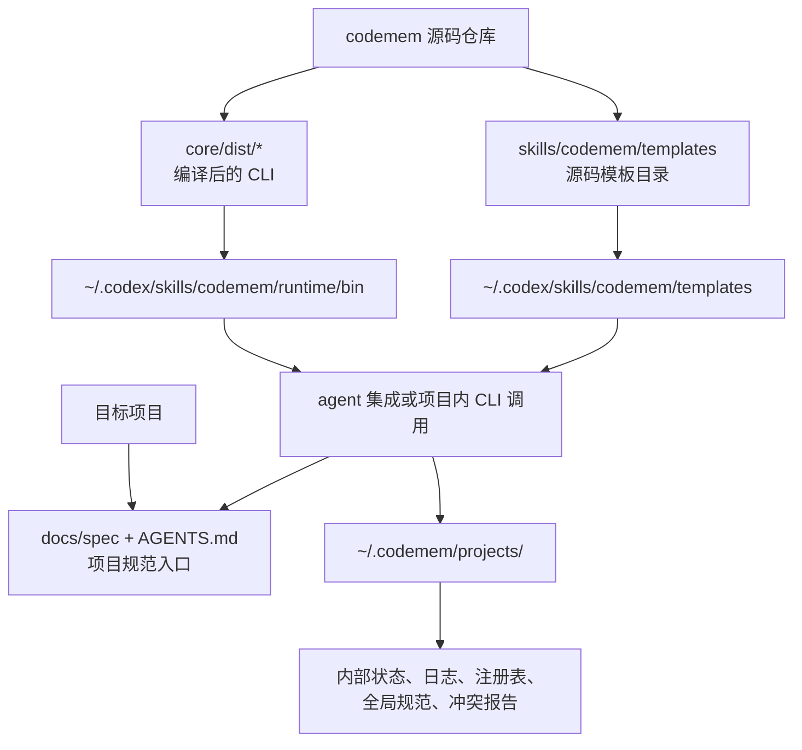

# codemem

`codemem` 是一个用于沉淀开发规范、生成可复用项目文档、打包共享规范，并把规范安装到其他项目中的工具仓库。

## 目录结构

- `core/src/`：运行时实现
- `core/dist/`：编译后的 CLI 二进制
- `skills/codemem/`：skill 提示词与模板
- `~/.codemem/projects/<project_state_key>/`：按项目隔离保存内部状态、日志、注册表、全局规范、冲突报告与安装包产物

## 共享资源结构



说明：

- `skills/codemem/templates/` 是仓库里的源码模板目录，只给构建、打包、安装器使用。
- `~/.codex/skills/codemem/scripts/`、`~/.codex/skills/codemem/runtime/bin/` 和 `~/.codex/skills/codemem/templates/` 是 agent skill 使用的共享资源，不提供 shell 全局命令。
- 目标项目只保留项目规范文档、`AGENTS.md` 等 agent 入口文件，不再复制 runtime、模板或 `.codemem/` 状态目录；内部状态按项目收归到 `~/.codemem/projects/<project_state_key>/`。

## 常用命令

```bash
bun run core/src/cli/agent.ts --root . install --agent cursor --target-dir <project_dir>
bun run core/src/cli/agent.ts --root . detect --agent cursor --target-dir <project_dir>
bun run core/src/cli/upgrade.ts --root . --agent cursor --target-dir <project_dir>
bun run core/src/cli/capture.ts --root . --project <project_name> --type architecture --title "规范标题" --rule "规范内容" --priority P1 --status active --scope project
bun run core/src/cli/build.ts --root . --project <project_name> --lang zh
bun run core/src/cli/package.ts --root . --project <project_name> --version <version> --lang zh
bun run core/src/cli/projects.ts --root .
```

## 安装使用

推荐在这个项目内构建并为目标项目安装 agent 集成，不再安装全局 `codemem` 命令。

如果用户只想在当前业务项目直接安装，可以在业务项目目录执行远程安装命令：

```bash
curl -fsSL https://raw.githubusercontent.com/fzf926/codemem/main/scripts/install.sh | bash -s -- --agent cursor
```

这条命令会把当前目录作为业务项目，临时 clone 当前仓库、构建 runtime、安装 agent skill，然后清理临时源码；不会安装 shell 全局 `codemem` 命令。同一台机器上，Cursor/Codex 的 skill 安装一次后可供所有项目使用。

如果你已经拿到了源码仓库，也可以执行：

```bash
cd <project_dir>
bash /path/to/codemem/scripts/install.sh --agent cursor
```

也可以直接运行源码 CLI：

```bash
bun run core/src/cli/agent.ts --root . install --agent cursor --target-dir <project_dir> --lang zh
```

推荐优先使用 `agent install` 给指定 code agent 安装集成。未传 `--skill-dir` 时，安装器会先自动探测常见 agent 安装位置；在交互式终端里如果探测到非默认目录，还会先让你确认；之后再在项目开发过程中让 AI 负责初始化、记录规范和建议更新文档。

如果你已经在本机装好了 `codemem` 集成，后续更新最简单的方式是在这个源码仓库里执行：

```bash
bun run core/src/cli/upgrade.ts --root . --agent cursor --target-dir <project_dir>
```

`upgrade` 会重建当前源码仓库并刷新 agent 共享资源，例如 `~/.codex/skills/codemem/`。

## 打包给别人使用

如果你想把本机生成的 skill 直接发给别人使用，推荐导出解压即用的 portable skill 包。这个包不需要执行安装脚本，也不会安装 shell 全局命令：

```bash
bun run core/src/cli/agent.ts --root . portable --version 0.1.0 --lang zh
```

把生成的这两个文件发给对方：

- `~/.codemem/projects/<project_state_key>/_system/packages/agents/codemem-skill-portable-0.1.0.tgz`
- `~/.codemem/projects/<project_state_key>/_system/packages/agents/codemem-skill-portable-0.1.0.tgz.sha256`

对方只需要解压到本机全局 skill 目录：

```bash
mkdir -p ~/.codex/skills
tar -xzf codemem-skill-portable-0.1.0.tgz -C ~/.codex/skills
```

解压后应得到 `~/.codex/skills/codemem/`，Codex 和 Cursor 都可以直接读取这个 skill。

如果你还需要 Claude Code 项目命令，或者希望自动写入不同 agent 的集成文件，也可以导出带 `install.mjs` 的 agent 安装包。导出的 `.tgz` 是自包含的，对方不需要拿到 `codemem` 源码仓库：

```bash
bun run core/src/cli/agent.ts --root . export --agent all --version 0.1.0 --lang zh
```

把生成的这两个文件发给对方：

- `~/.codemem/projects/<project_state_key>/_system/packages/agents/codemem-agent-kit-0.1.0.tgz`
- `~/.codemem/projects/<project_state_key>/_system/packages/agents/codemem-agent-kit-0.1.0.tgz.sha256`

对方解压后执行：

```bash
tar -xzf codemem-agent-kit-0.1.0.tgz
cd codemem-agent-kit-0.1.0
node install.mjs --agent cursor --target-dir /path/to/project
```

`install.mjs` 会按对方机器的真实路径写入 `SKILL.md` 或 `codemem.md`，不会使用打包者本机路径。

如果你后续不想继续使用，可以执行卸载命令。默认清理 agent 集成和旧版全局残留，会保留当前项目已经生成的规范历史：

```bash
bun run core/src/cli/uninstall.ts --target-dir <project_dir>
```

如果你确认也要删除目标项目里已经生成的规范历史和 codemem 项目侧引用，再显式加上参数：

```bash
bun run core/src/cli/uninstall.ts --delete-project-data true --target-dir <project_dir>
```

## 更多命令说明

完整命令参考请见 [docs/COMMANDS.md](docs/COMMANDS.md)。

## 完整安装与使用流程

如果你要安装到更多项目，推荐直接阅读 [docs/INSTALL.md](docs/INSTALL.md)。

如果你希望把安装任务直接交给 AI，让它自动判断安装方式并执行，请把 [docs/AI_INSTALL.md](docs/AI_INSTALL.md) 发给对应 agent。

## 安装策略

- 首次安装会返回 `installed`。
- 新版本覆盖旧版本时会返回 `upgraded`。
- 默认禁止降级安装；显式传入 `--allow-downgrade` 后会返回 `downgraded`。
- 默认禁止重复安装同一版本；显式传入 `--force` 后会返回 `reinstalled`。
- 默认禁止用不同的已安装包 ID 进行覆盖；显式传入 `--force` 后才允许替换。

## 安装包兼容性

- 当前可分享安装包使用 manifest `schema: 1`。
- 安装器要求 `compatibility.installerSchema: 1`。
- 安装包会记录生成它的 `codemem` 工具版本。
- 外部分发安装时，需要满足 manifest 中声明的 Node.js 运行时要求。

## 构建

```bash
bash scripts/build.sh
```

构建完成后，编译产物位于 `core/dist/`；开发态可以直接运行 `bun run core/src/cli/<command>.ts` 或使用 skill 内置的 `skills/codemem/scripts/codemem.mjs`。
