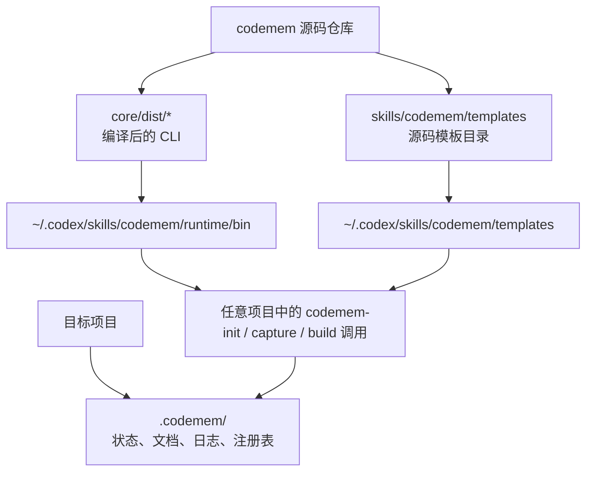

# codemem

`codemem` 是一个参考 gstack 组织方式构建的仓库，用来沉淀开发规范、生成可复用的项目文档、打包共享规范，并把规范安装到其他项目中。

## 目录结构

- `core/src/`：运行时实现
- `core/dist/`：编译后的 CLI 二进制
- `bin/`：轻量命令入口
- `skills/codemem/`：skill 提示词与模板
- `.codemem/`：生成的状态、日志、注册表与安装包产物

## 共享资源结构



说明：

- `skills/codemem/templates/` 是仓库里的源码模板目录，只给构建、打包、安装器使用。
- `~/.codex/skills/codemem/runtime/bin/` 和 `~/.codex/skills/codemem/templates/` 是安装后的全局共享资源。
- 目标项目只保留 `.codemem/` 状态与生成文档，不再复制 runtime 和模板副本。

## 常用命令

```bash
codemem capture \
  --project <project_name> \
  --type <general|architecture|code|api|data|security|testing|docs|ops|release> \
  --title "short title" \
  --rule "the actual standard sentence" \
  --priority <P0|P1|P2|P3> \
  --status <active|draft|deprecated> \
  --scope <project|global>
codemem build --project <project_name> --lang zh
codemem package --project <project_name> --version <version> --lang zh
codemem agent install
codemem agent install --agent codex --target-dir <project_dir>
codemem agent detect --agent codex --target-dir <project_dir>
codemem agent export --agent all --target-dir <output_dir>
codemem upgrade --agent cursor --target-dir <project_dir>
codemem upgrade --agent codex --target-dir <project_dir> --pull true
codemem projects
```

## 给别人安装

推荐给别人一个安装脚本入口。脚本会自动拉取 `codemem` 项目、构建 CLI、写入全局 `codemem` 命令，并安装对应 agent 集成。

如果脚本已经发布在 GitHub，可以让对方在目标项目目录直接执行：

```bash
curl -fsSL https://raw.githubusercontent.com/fzf926/codemem/main/scripts/install.sh | CODEMEM_REPO_URL=https://github.com/fzf926/codemem.git bash -s -- --agent cursor --target-dir .
```

如果对方已经拿到了源码仓库，也可以执行：

```bash
bash scripts/install.sh --agent cursor --target-dir <project_dir>
```

如果对方没有 GitHub SSH 权限，可以换成 HTTPS 源：

```bash
CODEMEM_REPO_URL=https://github.com/fzf926/codemem.git bash scripts/install.sh --agent cursor --target-dir <project_dir>
```

安装完成后，用户日常不需要进入源码目录，也不需要使用 `./bin/...`：

```bash
codemem agent install --agent cursor --target-dir <project_dir>
codemem upgrade
codemem projects
```

推荐优先使用 `codemem agent install` 给指定 code agent 安装集成。未传 `--skill-dir` 时，安装器会先自动探测常见 agent 安装位置；在交互式终端里如果探测到非默认目录，还会先让你确认；之后再在项目开发过程中让 AI 负责初始化、记录规范和建议更新文档。

如果你已经在本机装好了 `codemem` 集成，后续更新最简单的方式是直接进入目标项目目录执行 `codemem upgrade`。当未传 `--agent` 和 `--target-dir` 时，它会优先把当前工作目录当成目标项目，并根据已安装集成自动识别当前 agent。

## 更多命令说明

完整命令参考请见 [docs/COMMANDS.md](docs/COMMANDS.md)。

## 完整安装与使用流程

给其他团队或项目使用时，推荐直接阅读 [docs/INSTALL.md](docs/INSTALL.md)。

## 安装策略

- 首次安装会返回 `installed`。
- 新版本覆盖旧版本时会返回 `upgraded`。
- 默认禁止降级安装；显式传入 `--allow-downgrade` 后会返回 `downgraded`。
- 默认禁止重复安装同一版本；显式传入 `--force` 后会返回 `reinstalled`。
- 默认禁止用不同的已安装包 ID 进行覆盖；显式传入 `--force` 后才允许替换。

## 安装包兼容性

- 当前可分享安装包使用 manifest `schema: 1`。
- 安装器要求 `compatibility.installerSchema: 1`。
- 安装包会记录生成它的 `codemem` 工具版本。
- 外部分发安装时，需要满足 manifest 中声明的 Node.js 运行时要求。

## 构建

```bash
bash scripts/build.sh
```

构建完成后，`bin/*` 会优先使用 `core/dist/` 下的编译产物；在开发态找不到编译产物时，会自动回退到 `bun run`。
