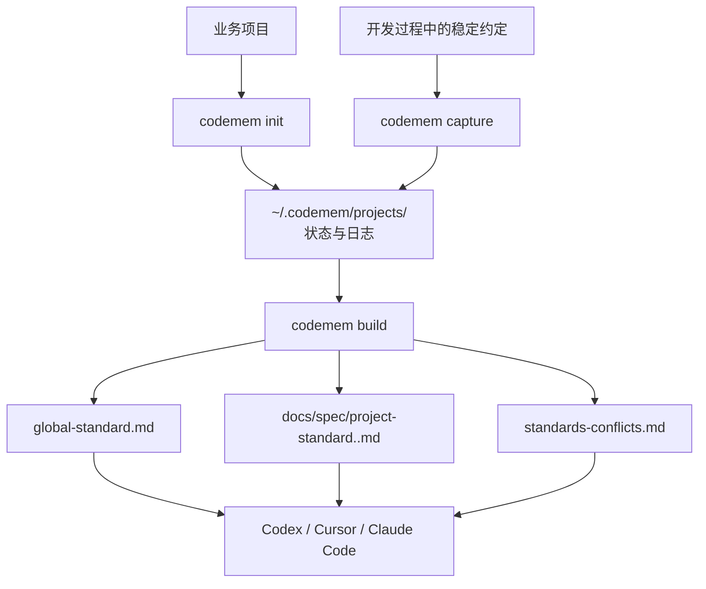

# codemem 项目分享稿

`codemem` 是一个面向 AI 编程协作的开发规范沉淀工具。它把项目里的稳定工程约定记录下来，生成可读的规范文档，并把这些规范接入 Codex、Cursor、Claude Code 等 agent，让 AI 在后续开发时能先读规范、再写代码。

## 它解决什么问题

AI 很擅长写代码，但在长期项目里经常遇到三个问题：

- 项目规范散落在历史代码、口头约定和评审意见里，新会话很难自动继承。
- 架构改造完成后，新的工程约定没有沉淀下来，下次又回到靠人提醒。
- 多个项目之间想共享规范时，复制文档和同步更新都很麻烦。

`codemem` 的目标是把这些隐性约定变成可维护、可分享、可安装的项目资产。

## 核心能力

- 初始化项目规范空间：目标项目只保留规范入口文档，内部状态、项目标记、日志和共享规范按项目写入 `~/.codemem/projects/<project_state_key>/`。
- 记录开发规范：通过 `codemem capture` 逐条追加规范，支持分类、优先级、状态、项目级/全局级作用域。
- 生成规范文档：通过 `codemem build` 输出全局规范、项目规范和冲突报告。
- 接入代码 agent：通过 `codemem agent install` 安装到 Codex、Cursor 或 Claude Code。
- 分享规范包：通过 `codemem package` 和 `codemem install` 把一个项目的规范分发给其他项目。
- 统一升级和卸载：在 `codemem` 源码项目内执行升级脚本刷新 skill runtime、templates 和 agent 集成；卸载命令会清理 agent 资源，并兼容清理旧版全局命令残留。

## 工作方式



安装到 agent 后，AI 的默认行为是：

- 开始改代码前先读取已有规范文档。
- 项目未初始化时自动推断项目名并初始化。
- 当开发过程暴露出稳定约定时，记录规范并重新生成文档。
- 对架构重构、策略/工厂抽取、MQ 消费分发改造等可复用工程约定保持敏感。
- 只有项目身份不确定、可能覆盖重要内容、规范冲突无法自动决策时才打断确认。

## 推荐分享方式：导出解压即用的 skill 包

如果你希望把本机生成的 `codemem` skill 直接给别人使用，推荐导出 portable skill 包。这个包不需要执行安装脚本，也不会安装 shell 全局命令：

```bash
bun run core/src/cli/agent.ts --root . portable --version 0.1.0 --lang zh
```

导出后把这两个文件发给对方：

- `~/.codemem/projects/<project_state_key>/_system/packages/agents/codemem-skill-portable-0.1.0.tgz`
- `~/.codemem/projects/<project_state_key>/_system/packages/agents/codemem-skill-portable-0.1.0.tgz.sha256`

这个 `.tgz` 是自包含 skill 包，包含 skill 文档、JavaScript runtime、模板和兼容 runtime。使用方不需要拿到 `codemem` 源码仓库。

对方拿到包后，先校验摘要：

```bash
shasum -a 256 codemem-skill-portable-0.1.0.tgz
cat codemem-skill-portable-0.1.0.tgz.sha256
```

然后直接解压到全局 skill 目录：

```bash
mkdir -p ~/.codex/skills
tar -xzf codemem-skill-portable-0.1.0.tgz -C ~/.codex/skills
```

解压后应得到：

```text
~/.codex/skills/codemem/SKILL.md
~/.codex/skills/codemem/scripts/codemem.mjs
~/.codex/skills/codemem/templates/
```

Codex 和 Cursor 都可以直接读取这个 skill。Claude Code 的 `/codemem` 项目命令需要写入 `.claude/commands/codemem.md`，这种场景继续使用带 `install.mjs` 的 agent 安装包。

## 源码项目内安装方式

如果只是让对方快速安装到当前业务项目，可以直接给这条远程命令：

```bash
curl -fsSL https://raw.githubusercontent.com/fzf926/codemem/main/scripts/install.sh | bash -s -- --agent cursor
```

这条命令会把当前目录作为业务项目，临时 clone `codemem` 源码、构建 runtime、安装 agent skill，然后清理临时源码；不会安装 shell 全局 `codemem` 命令。同一台机器上，Cursor/Codex 的 skill 安装一次后可供所有项目使用。

如果已经拿到源码仓库，可以在源码仓库中执行：

```bash
cd /path/to/target-project
bash /path/to/codemem/scripts/install.sh --agent cursor
```

安装完成后，日常在目标项目里直接让 Cursor、Codex 或 Claude Code 调用 `codemem` skill；需要检测或升级时，回到 `codemem` 源码项目执行：

```bash
bun run core/src/cli/agent.ts --root . detect --agent cursor --target-dir /path/to/target-project
bun run core/src/cli/upgrade.ts --root . --agent cursor --target-dir /path/to/target-project
bun run core/src/cli/projects.ts --root .
```

## 在不同 agent 中使用

### Cursor

```bash
bun run core/src/cli/agent.ts --root . install --agent cursor --target-dir /path/to/project
```

安装后，在 Cursor 中调用 `codemem` skill，让它负责初始化、读取规范、记录规范和生成文档。

### Codex

```bash
bun run core/src/cli/agent.ts --root . install --agent codex --target-dir /path/to/project
```

安装后，Codex 会从 `~/.codex/skills/codemem/` 读取 skill、runtime 和 templates。

### Claude Code

```bash
bun run core/src/cli/agent.ts --root . install --agent claude-code --target-dir /path/to/project
```

安装后，可以通过 `/codemem` 命令使用这套规范工作流。

## 常用命令速查

```bash
# 初始化项目
bun run core/src/cli/init.ts --root . --project <project_name> --owner <owner_name>

# 记录一条规范
bun run core/src/cli/capture.ts --root . \
  --project <project_name> \
  --type architecture \
  --title "MQ 消费策略分发" \
  --rule "MQ 消费者应按 topic 构建策略工厂，并按 tag 路由到对应策略，避免在消费入口堆叠 if/else 分支。" \
  --priority P1 \
  --status active \
  --scope project

# 生成规范文档
bun run core/src/cli/build.ts --root . --project <project_name> --lang zh

# 打包分享规范
bun run core/src/cli/package.ts --root . --project <project_name> --version 1.0.0 --lang zh

# 安装别人分享的规范包
bun run core/src/cli/install.ts --root . --package <package_dir_or_tgz> --target <target_project_dir> --project <target_project_name>

# 刷新本机安装
bun run core/src/cli/upgrade.ts --root . --agent cursor --target-dir <target_project_dir>
```

## 生成的文件

目标项目中主要生成：

- `docs/spec/project-standard.<project_name>.md`
- `AGENTS.md`
- `.cursor/rules/codemem-standards.mdc`（Cursor 场景）

内部状态按项目写入用户目录：

- `~/.codemem/projects/<project_state_key>/docs/global/global-standard.md`
- `~/.codemem/projects/<project_state_key>/docs/reports/standards-conflicts.md`
- `~/.codemem/projects/<project_state_key>/_system/logs/standards/<project_name>.jsonl`
- `~/.codemem/projects/<project_state_key>/project.json`

用户目录中主要安装 agent skill 资源：

- `~/.codex/skills/codemem/`

## 适合分享给谁

- 经常和 AI agent 一起做业务迭代的团队。
- 有多项目、多仓库工程规范沉淀需求的团队。
- 希望把“评审里反复提醒的约定”变成可复用文档和 agent 上下文的人。
- 正在推进架构统一、模块边界治理、消费链路治理、接口规范统一的项目。

## 一个典型使用场景

假设一个项目原来的 MQ 消费入口通过大量 `if/else` 判断 tag：

```text
topic A
  tag X -> 逻辑 X
  tag Y -> 逻辑 Y
  tag Z -> 逻辑 Z
```

当团队把它改造成“topic 工厂 + tag 策略”的结构后，这不只是一次代码改造，也是一条新的工程约定。`codemem` 希望把这类约定记录下来，例如：

```text
MQ 消费者应按 topic 构建策略工厂，并按 tag 路由到对应策略，避免在消费入口堆叠 if/else 分支。
```

这样下次新增 topic 或 tag 时，AI 会先读到这条规范，再按同一套结构扩展。

## 后续资料

- AI 自动安装说明：[AI_INSTALL.md](./AI_INSTALL.md)
- 完整安装流程：[INSTALL.md](./INSTALL.md)
- 命令参考：[COMMANDS.md](./COMMANDS.md)
- 项目 README：[../README.md](../README.md)
